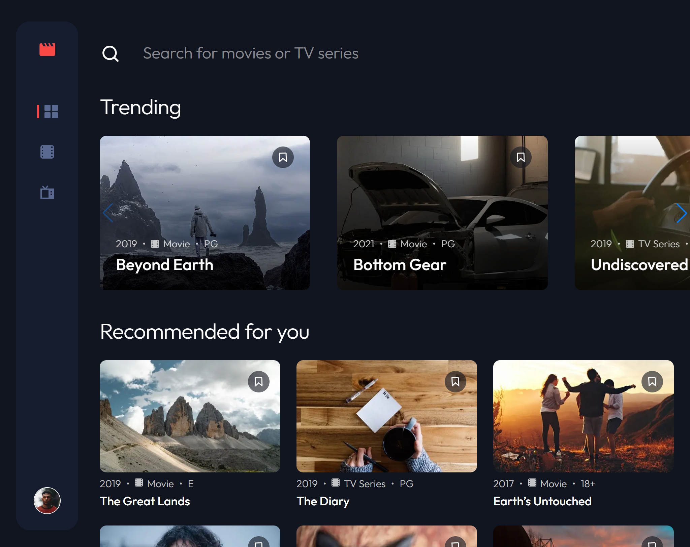

# Entertainment Web App

A responsive entertainment web application designed to browse movies and TV series, search through media, and bookmark favorites. Built with performance and user experience in mind using **TypeScript**, **Tailwind CSS**, and dynamic UI components.

## 🚀 Features

- **Trending Carousel:** Highlights top trending movies and TV series using **Swiper.js** for smooth, touch-friendly horizontal scrolling.
- **Local JSON Data Integration:** Serves media items dynamically from a local `data.json` file.
- **Interactive UI & Loading States:** Dedicated loading indicators and Skeleton UI ensure a smooth, polished user experience while fetching or parsing data.
- **Search & Categorization:** Easily filter content across movies, TV series, and bookmarked titles.
- **Fully Responsive:** Styled with **Tailwind CSS** to offer a seamless layout across desktop, tablet, and mobile screen sizes.
- **Type-Safe Development:** Constructed with **TypeScript** to ensure strict data modeling and predictable state handling.

## 🛠️ Tech Stack

- **Frontend:** TypeScript, React / Next.js
- **Styling:** Tailwind CSS
- **Carousel / Slider:** Swiper.js
- **Data Source:** Local `data.json`
- **Icons:** Lucide React / Custom SVG Icons